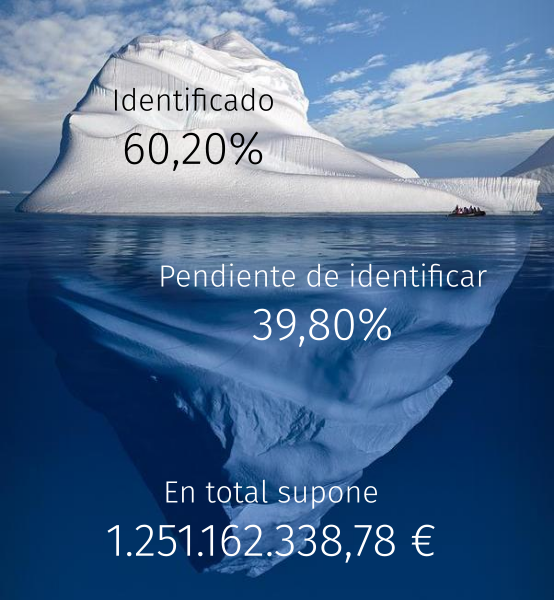

```{r echo=F}
require(knitr)
opts_chunk$set(comment=NA, results='asis', tidy=F, message=F, cache=F, echo=F)
options(RCHART_WIDTH=800, RCHART_HEIGHT=400, xtable.type='html')
```

<script src="http://ajax.googleapis.com/ajax/libs/jquery/1.9.1/jquery.min.js"></script>

</p>

<p style='font-size:50%; text-transform: lowercase;'>http://auditasanidad.org/</p>


--- &vertical

<!-- ## Evolución de la deuda de la Comunidad de Madrid -->
<!-- ```{r, results='asis'} -->
<!-- require(htmlwidgets) -->
<!-- require(dygraphs) -->
<!-- datos <- read.csv("datos/evolucion-deuda-madrid.csv") -->
<!-- deuda <- ts(datos$Deuda, start=c(2000, 1), end=c(2015, 1), frequency=1) -->
<!-- dygraph(deuda, main = "") -->
<!-- ``` -->

<!-- *** -->

<!-- ## Evolución de la deuda de la Comunidad de Madrid -->
<!-- ```{r deuda_comunidad_madrid2} -->
<!-- require(htmlwidgets) -->
<!-- require(plotly) -->
<!-- datos <- read.csv("datos/evolucion-deuda-madrid.csv") -->
<!-- x <- list(title = "Año") -->
<!-- y <- list(title = "Millones de €") -->
<!-- p <- plot_ly(x = datos$Anio, y = datos$Deuda, name = "Deuda", type = "bar") %>% -->
<!--   layout(xaxis = x, yaxis = y) -->
<!-- p -->
<!-- ``` -->

<!-- *** -->

## Evolución de la deuda de la Comunidad de Madrid
```{r deuda-comunidad-madrid}
require(rCharts)
data <- read.table("datos/evolucion-deuda-madrid.csv", header = TRUE, sep=",")
p1 <- nPlot(Deuda ~ Anio, data = data, type = "multiBarChart")
p1
```

<!-- *** -->

<!-- ## Evolución de la deuda de la Comunidad de Madrid -->
<!-- ```{r } -->
<!-- require(htmlTable) -->
<!-- colnames(data) <- c("Año", "Deuda") -->
<!-- tmp <- htmlTable(data, align="lr", rnames=FALSE, css.class="colortable",  -->
<!--   tfoot="<span class=\"footnote\">Fuente: Elaboración propia</span>") -->
<!-- (tmp <- gsub('<td', '<td nowrap="nowrap"; ', tmp)) -->
<!-- ``` -->

---


## 

---

## Gasto en medios ajenos

```{r gasto-medios-ajenos}
require(rCharts)
data <- read.table("datos/gasto-medios-ajenos.csv", header = TRUE, sep=",")
p2 <- nPlot(Cantidad ~ Tipo.de.gasto, data = data, type = "pieChart")
p2
```

---

## Actividades realizadas con medios ajenos

```{r actividades-medios-ajenos}
require(rCharts)
data <- read.table("datos/actividades-medios-ajenos.csv", header = TRUE, sep=",")
p3 <- nPlot(Cantidad ~ Actividad, data = data, type = "multiBarHorizontalChart")
p3
```

---

## Actividades realizadas con medios ajenos

```{r evolucion-ventas-genericos}
require(rCharts)
data <- read.table("datos/evolucion-ventas-genericos.csv", header = TRUE, sep=",")
p4 <- nPlot(Porcentaje.Gasto~ Año, group="Tipo", data = data, type = "lineChart")
p4
```

## ¡Gracias por su atención!


